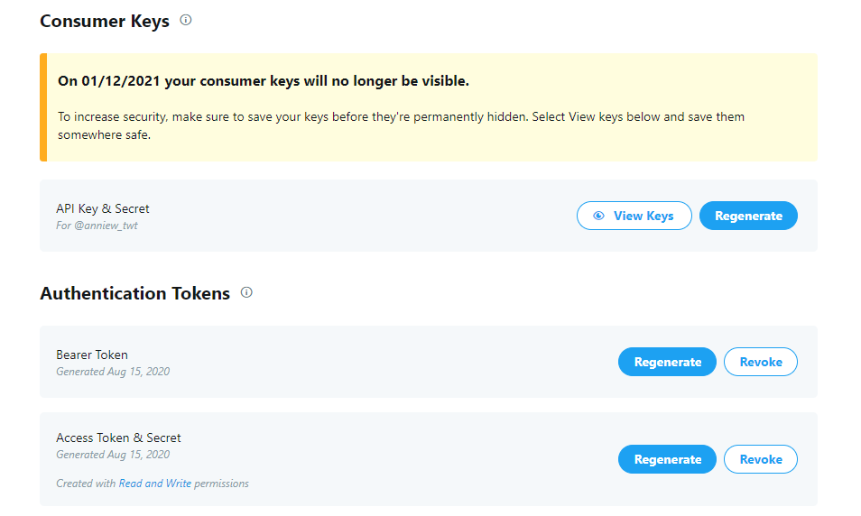
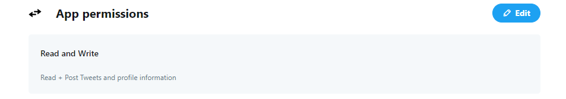
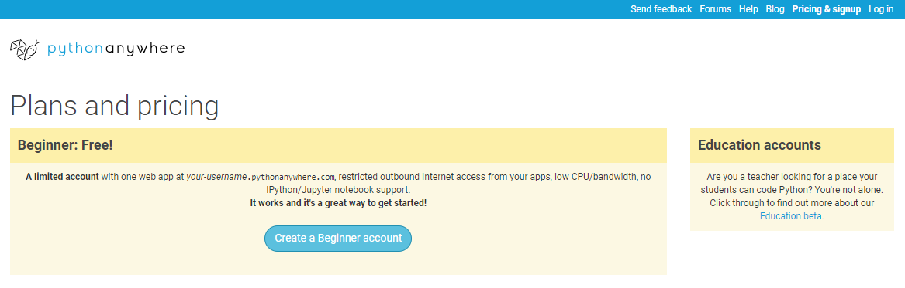
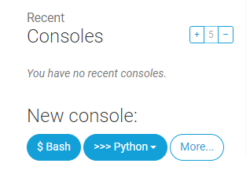
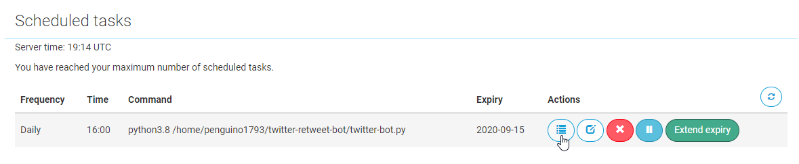

# Twitter Like and Retweet Bot 	:heart::repeat:


[](https://www.python.org/downloads/release/python-385/)
[](http://docs.tweepy.org/en/latest/)
[](https://github.com/Naereen/badges/)
<span class="badge-buymeacoffee"><a href="https://www.buymeacoffee.com/awu2303" title="Donate to this project using Buy Me A Coffee"></a>
</span>


A Twitter bot written in Python using Tweepy and hosted on a server. It will like and/or retweet tweets that contain single or multiple keywords and hashtags. 

---

### Table of Contents

- [Getting Started](#getting-started)
    - [Prerequisites](#prerequisites)
        - [To Run the Bot](#to-run-the-bot)
        - [To Host the Bot](#to-host-the-bot)
            - [On PythonAnywhere](#on-pythonanywhere)
            - [On Amazon Web Services](on-amazon-web-services)
- [Instructions](#instructions)
    - [File Structure](#file-structure)
- [Deployment](#deployment)
    - [PythonAnywhere](#pythonanywhere)
    - [Amazon Web Services](#amazon-web-services)
- [Creator / Maintainer](#creator-maintainer)
- [Additional Information](#additional-information)

---

## Getting Started

Make sure to follow [Twitter's Automation Rules](https://help.twitter.com/en/rules-and-policies/twitter-automation) to avoid getting your account banned.

### Prerequisites

#### To Run the Bot

- [Python 3](https://www.python.org/downloads/)
- [Pip](https://pypi.org/project/pip/) - a python package manager
    - Download this [file](https://bootstrap.pypa.io/get-pip.py), open a command prompt and navigate to the folder containing the `get-pip.py` installer, and run `python get-pip.py` to install
    - Run `pip --version` to check if it has installed correctly
- [Tweepy](http://docs.tweepy.org/en/latest/index.html) - an easy-to-use python library for accessing Twitter's API
    - Run `pip install tweepy`

#### To Host the Bot

Since the TwitterAPI search index can only retrieve tweets posted within the past 7 days, if the hashtags or keywords are not super popular, I would recommend hosting it on PythonAnywhere and scheduling a task to run `twitter-bot.py` at a certain time everyday, so the script will not just stop when there are no more tweets to process.

Otherwise, you can deploy it on AWS EC2 to run the bot 24/7.

##### On PythonAnywhere

- [PythonAnywhere](https://www.pythonanywhere.com/) - an online integrated development environment and web hosting service based on the Python programming language

##### On Amazon Web Services
- [Amazon Web Services EC2](https://aws.amazon.com/ec2/) - a web service that provides secure, resizable compute capacity in the cloud
- [PuTTY](https://www.putty.org/) - an open-source terminal emulator, serial console and network file transfer application
- [WinSCP](https://winscp.net/eng/download.php) - a client that allows secure file transfers between the client's local computer and the remote server

---

## Instructions

1. Apply for [Twitter Developer Access](https://developer.twitter.com/en/apply-for-access) with the account you want the bot to be used for.

2. Create a new [Twitter Application](https://developer.twitter.com/app/new) to generate your private keys, secrets, and tokens.



- Make sure the app settings has *Read and Write* permissions.



3. Create a file named `credentials.py` to hold the private information using the format below.
    - See [File Structure](#file-structure) for where the file should be placed.

```
TWITTER_API_KEY="xxxx"
TWITTER_API_KEY_SECRET="xxxx"
TWITTER_ACCESS_TOKEN="xxxx"
TWITTER_ACCESS_TOKEN_SECRET="xxxx"
```

4. Adjustments you can make in `config.py` to tweak the bot to your liking. *(Keep in mind the TwitterAPI search index has a 7-day limit, no tweets will be found for a date older than one week.)*
    - **search_keywords** - Keyword(s) and/or hashtag(s) that you want to retweet
    - **delay** - Time to wait between processing requests in seconds
        - Please be aware of the [TwitterAPI rate limits](https://developer.twitter.com/en/docs/twitter-api/v1/rate-limits)
    - **result_type** - Specify what type of search results you want to get
        - "recent", "popular", or "mixed"
    - **number_of_tweets** - Specify the number of tweets you want the bot to iterate through
    - **run_continuously** - Set True if you want the bot to run continuously
        - Also set True if you will be deploying the script
    - **retweet_tweets**, **like_tweets** - Adjust booleans for whether you want to only retweet, only like, or do both

5. Run the script. Enjoy your Twitter bot!
```
python twitter-bot.py
```

### File Structure

```
Twitter-Retweet-Bot
 |-- config.py
 |-- credentials.py
 |-- requirements.txt
 |-- twitter-bot.py
```

---


## Deployment

Here is a tutorial on how to deploy / host the bot on a server.

### PythonAnywhere

1. Create a free Beginner [PythonAnywhere](https://www.pythonanywhere.com/pricing/) account.




2. Go to Files, create a new Directory, upload the three `.py` files.


3. Create a new bash console on your Dashboard and run pip with your python version to install tweepy



```
pip3.8 install --user tweepy
```

4. Copy the file path, go to Tasks, enter the [UTC](https://www.worldtimeserver.com/current_time_in_UTC.aspx) time you want the script to run at, and enter the python version and file path with `twitter-bot.py` at the end.

```
python3.8 /home/account-name/directory-name/twitter-bot.py	
```


5. After the task runs as the scheduled time, you can check the task log to see the bot running



### Amazon Web Services

1. Launch an EC2 instance on Amazon Web Services.
    - See [Additional Information](#additional-information) for more details.


2. Load the key-pair file (.pem) into PuTTYgen (which was downloaded when you installed [PuTTY](https://www.putty.org/)) and save the private key as a private key file (.ppk).


3. Connect to your instance on [WinSCP](https://winscp.net/eng/download.php).
    - The host name is ubuntu@[public DNS here].
    - Click Advanced, go to Authentication under SSH, and load the previously generated private key file (.ppk).
    - Login to the session.


4. Use [WinSCP](https://winscp.net/eng/download.php) to transfer the project's .py files to the server.


5. Connect to your instance on a bash command line using one of the following ways.
    - Use a bash shell with the example ssh command (I use [Git Bash](https://gitforwindows.org/)).
        - Make sure you are in the directory with the key-pair file (.pem).
    - Use [PuTTY](https://docs.aws.amazon.com/AWSEC2/latest/UserGuide/putty.html?icmpid=docs_ec2_console) with the public DNS and private key file (.ppk).
    


6. Install python and pip to the server on the bash command line.
```
sudo apt update 
sudo apt upgrade
sudo apt install python3
sudo apt install python3-pip
pip3 install update pip
```

7. Check if python and pip have been installed correctly.
```
python3 --version
pip3 --version
```

8. Install tweepy to the server.
```
pip3 install tweepy
```

9. Run the script. Enjoy!.
```
python3 twitter-bot.py
```

10. See [Additional Information](#additional-information) for details on running the script continuously.
    - I used the *screen* option.

---

### Creator / Maintainer

Annie Wu ([anniewu2303](https://github.com/anniewu2303)) 

If you have any questions about the code, feel free to contact me anywhere below.

<p align="left">
  <a href="mailto:anniewu2303@gmail.com"> 
    
  </a>
  <a href="https://www.linkedin.com/in/anniewu2303/"> 
    
  </a>
  <a href="https://twitter.com/intent/follow?screen_name=anniedotexe"> 
    
  </a>
  <a href="https://www.instagram.com/anniewu_photo/"> 
    
  </a>
</p>

This project was created for educational purposes of learning development, documentation, and deployment and for personal and open-source use.

Default values of the project are used to run [@ac_celeste_bot](https://twitter.com/ac_celeste_bot). 

If you like my content or find this code useful, give it a :star: or support me by buying me a coffee :coffee::grinning:

<a href="https://www.buymeacoffee.com/awu2303" target="_blank"></a>

---

## Additional Information

- [Getting Started with Amazon EC2](https://aws.amazon.com/ec2/getting-started/)
- [How to Continuously Run a Python Script on an EC2 Server](https://intellipaat.com/community/9361/how-to-continuously-run-a-python-script-on-an-ec2-server)
