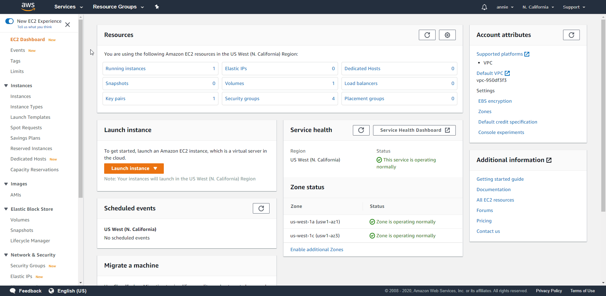
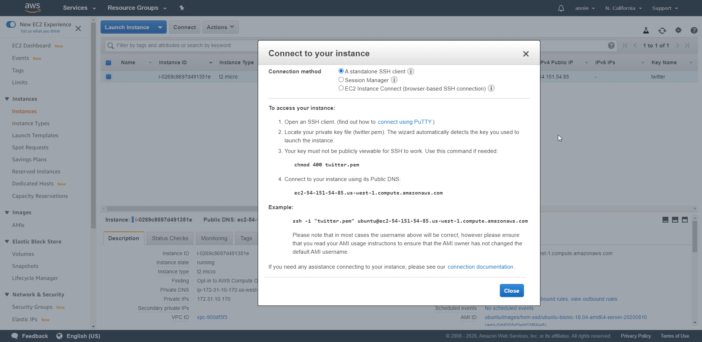
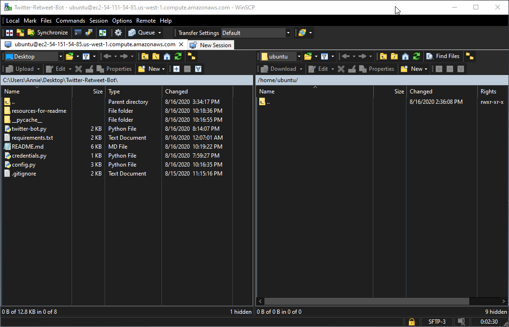
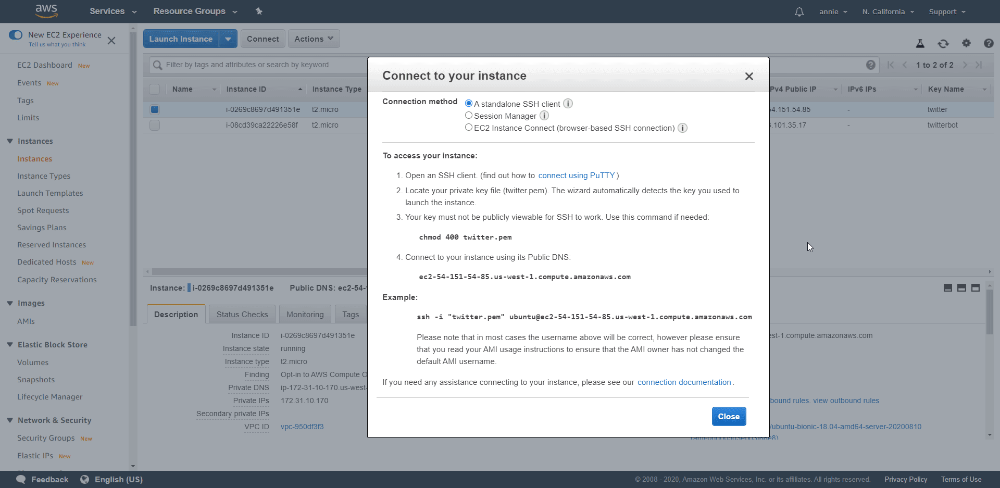
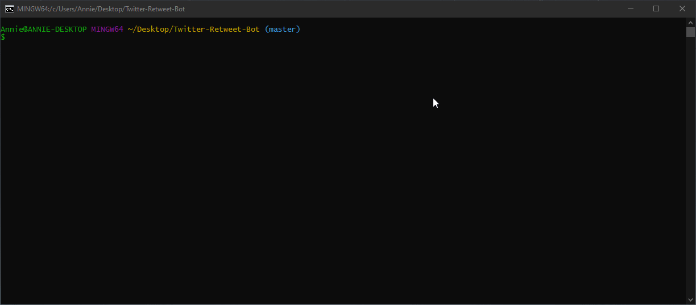

# Twitter Like and Retweet Bot

[](https://www.python.org/downloads/release/python-385/)
[](http://docs.tweepy.org/en/latest/)

A Twitter bot written in Python using Tweepy and deployed on AWS EC2. It will like and/or retweet tweets that contain single or multiple keywords and hashtags. Default values of the project are used to run [@ac_celeste_bot](https://twitter.com/ac_celeste_bot).

## Requirements

- [Python 3](https://www.python.org/downloads/)
- [Pip](https://pypi.org/project/pip/) - a python package manager
- [Tweepy](http://docs.tweepy.org/en/latest/index.html) - an easy-to-use python library for accessing Twitter's API
- [Amazon Web Services EC2](https://aws.amazon.com/ec2/) - a web service that provides secure, resizable compute capacity in the cloud
- [PuTTY](https://www.putty.org/) - an open-source terminal emulator, serial console and network file transfer application
- [WinSCP](https://winscp.net/eng/download.php) - a client that allows secure file transfers between the client's local computer and the remote server
- Make sure to follow [Twitter's Automation Rules](https://help.twitter.com/en/rules-and-policies/twitter-automation) to avoid getting your account banned

### Instructions

1. Apply for [Twitter Developer Access](https://developer.twitter.com/en/apply-for-access) with the account you want the bot to be used for

2. Create a new [Twitter Application](https://developer.twitter.com/app/new) to generate your private keys, secrets, and tokens


- Make sure the app settings has *Read and Write* permissions


3. Create a file named `credentials.py` to hold the private information using the format below
    - See [File Structure](#file-structure) for where the file should be placed

```
TWITTER_API_KEY="xxxx"
TWITTER_API_KEY_SECRET="xxxx"
TWITTER_ACCESS_TOKEN="xxxx"
TWITTER_ACCESS_TOKEN_SECRET="xxxx"
```

4. Adjustments you can make in `config.py` to tweak the bot to your liking
    - *Keep in mind the TwitterAPI search index has a 7-day limit, no tweets will be found for a date older than one week*
    - `search_keywords` - Keyword(s) and/or hashtag(s) that you want to retweet
    - `delay` - Time to wait between processing requests in seconds
        - Please be aware of the [TwitterAPI rate limits](https://developer.twitter.com/en/docs/twitter-api/v1/rate-limits)
    - `result_type` - Specify what type of search results you want to get
        - "recent", "popular", or "mixed"
    - `number_of_tweets` - Specify the number of tweets you want the bot to iterate through
    - `run_continuously` - Set True if you want the bot to run continuously
        - Also set True if you will be deploying the script
    - `retweet_tweets`, `like_tweets` - Adjust booleans for whether you want to only retweet, only like, or do both

5. Install Tweepy
```
pip install tweepy
```

6. Run the script. Enjoy your Twitter bot!
```
python twitter-bot.py
```

### File Structure
```
Twitter-Retweet-Bot
 |-- config.py
 |-- credentials.py
 |-- requirements.txt
 |-- twitter-bot.py
```

## Deployment

1. Launch an EC2 instance on AWS
    - See [Additional Information](#additional-information) for more details




2. Load the key-pair file (.pem) into PuTTYgen (which was downloaded when you installed puTTY) and save the private key as a private key file (.ppk) 


3. Connect to your instance on WinSCP
    - The host name is ubuntu@[public DNS here]
    - Click Advanced, go to Authentication under SSH, and load the previously generated private key file (.ppk)
    - Login to the session



4. Use WinSCP to transfer the project's .py files to the server



5. Connect to your instance on a bash command line using one of the following ways
    - Use a bash shell with the example ssh command (I use [Git Bash](https://gitforwindows.org/))
        - Make sure you are in the directory with the key-pair file (.pem)
    - Use [PuTTY](https://docs.aws.amazon.com/AWSEC2/latest/UserGuide/putty.html?icmpid=docs_ec2_console) with the public DNS and private key file (.ppk)
    


6. Install python and pip to the server on the bash command line
```
sudo apt update 
sudo apt install python3
sudo apt install python3-pip
```

7. Check if python and pip have been installed correctly
```
python3 --version
pip3 --version
```

8. Install tweepy to the server
`pip3 install tweepy`

9. Run the script. Enjoy!
`python3 twitter-bot.py`

10. See [Additional Information](#additional-information) for details on running the script continuously on EC2 server
    - I used the `screen` option

## Test Running the Script

Test `config.py` values:
```
keywords = '%23overwatch%20OR%20captain america'
delay = 5
result_type = 'popular'
number_of_tweets = 5
run_continuously = False
retweet_tweets = False
like_tweets = True
```




## Additional Information

- [Getting Started with Amazon EC2](https://aws.amazon.com/ec2/getting-started/)
- [How to Continuously Run a Python Script on an EC2 Server](https://intellipaat.com/community/9361/how-to-continuously-run-a-python-script-on-an-ec2-server)

-----

- This project was created for the purpose of learning development, documentation, and deployment.
- If you like this project or found this code useful, feel free to buy me a coffee
<a href="https://www.buymeacoffee.com/awu2303" target="_blank"></a>